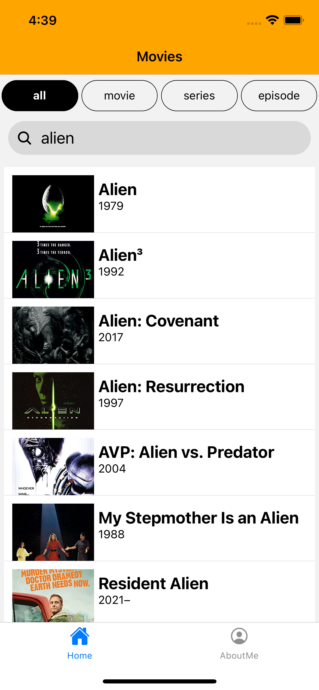
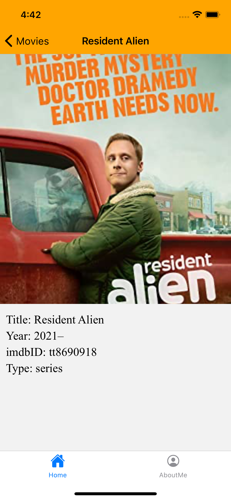
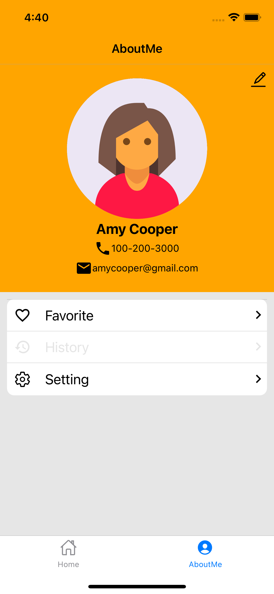
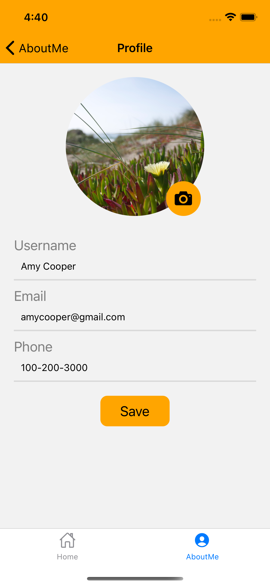

# Movie Browser Mobile App

The project is inspired by project2 from [CS50's Mobile App Development with React Native](https://www.edx.org/course/cs50s-mobile-app-development-with-react-native).
The original requirement of the project is [here](./statics/cs50_project2_README.md). 

## Demo

<video src='./statics/demo.mp4' width='50%'/>

## Reusable Components  
- ButtonGroup
- Searchbar
- User profile 
- Editing profile
- List with swipeable row
